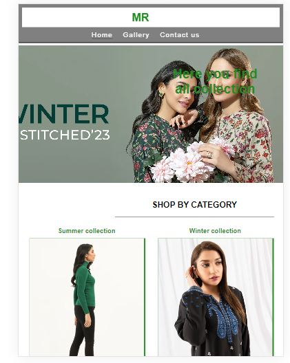
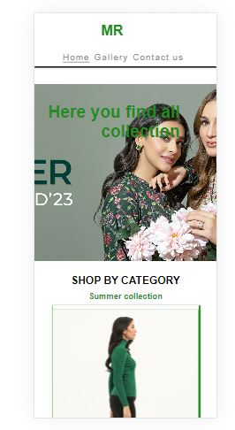

**Purpose of the project:**

The purpose of my project is to create a basic e-commerce website consisting of three main pages: a homepage, a product catalog (gallery) page, and a contact us page. On the gallery page, customers can browse through the available products in the catalog, and on the contact us page, they can get in touch with us for any inquirie.

**User Story:**
Home:
I, as a user,  want to visit the homepage to quickly understand the website's purpose, navigate easily through its content.

Gallery:
I, as a visitor, to see the categories of product.

contact Us:
I, as a visitor, to reach out to the company for business inquiries.

**Feature:**
Home page:
Navigation Menu: Include a navigation menu to access other sections of the website.
Banner: In side the home page user can view the adversitment of colection.
Social Icons: Display recognizable social media icons (e.g., Facebook, Twitter, Instagram) in the website's footer.
Clickable Links: Make the social media icons clickable links that lead to your respective social media profiles.
Social Media Integration: Ensure the links are properly configured to open in new tabs or windows, directing users to your social media pages.
Maintain the same layout, positioning, and design for the footer and menu throughout the entire website.

Gallery:
Product list: Display a list of available products.
"Add to Cart" Display (Non-Functional): Include a "Display-Only" "Add to Cart" button at the bottom of each product listing.

Contact Us Page:
Contact Information: Provide contact information such as an email address or contact form.
Include a welcoming message inviting users to get in touch for inquiries or assistance.
User-Friendly Design: Create a user-friendly page with clear contact details.
It is also contain map.

**Typography and colorscheme**
Font Family: The 'Lato' font family, a sans-serif typeface, has been selected for use across the website.
Font Colors: The color scheme for text is primarily green and white.

**wirefram**

**Technologies**
I have used Codeanywhere worksapce for  developing the website, and Github.

**Testing**
1)Code Validation:

**Test cases**
Test Case1:
1)Click on the <https://8000-meena-rathi-shopping-t5i0p7g8wj.us2.codeanyapp.com/index.html>.
2)click on the menu bar "home"
3)And the redirected to the home pgae.
4)It shows the banner and categories iamges and footer.

Test Case 2:
1)Click on the <https://8000-meena-rathi-shopping-t5i0p7g8wj.us2.codeanyapp.com/index.html>.
2)click on the menu bar "Galley"
3)And the redirected to the Gallery page.
4)It shows the categories of 8 images and footer.

Test Case 3:
1)Click on the <https://8000-meena-rathi-shopping-t5i0p7g8wj.us2.codeanyapp.com/index.html>.
2)click on the menu bar "SignUp"
3)And the redirected to the Signup page.
4)Fill out the form and then click on the submit.
5)this page redirected to confirmation page.

Test Case 4:
1)Click on the <https://8000-meena-rathi-shopping-t5i0p7g8wj.us2.codeanyapp.com/index.html>.
2)click on the menu bar "SignUp"
3)And the redirected to the Signup page.s
4)click on the footer icon.
5)it redirected to new window(fb, twitter).

**Fixed Bugs**

**Supported Screen and browser**

**Deployment**
Github
I made a GitHub repository and set up a Codeanywhere workspace, pasting the repository into the workspace for use.
 Github Pages
