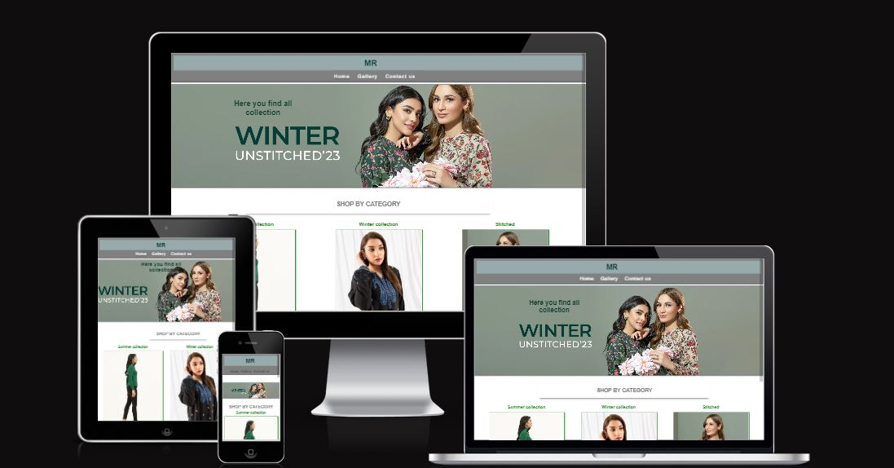

## Purpose of the project ##

The purpose of my project is to create a basic e-commerce website consisting of three main pages: a homepage, a product catalog (gallery) page, and a contact us page. On the gallery page, customers can browse through the available products in the catalog, and on the contact us page, they can get in touch with us for any inquirie.

## User Story ##

**Home**

I, as a user,  want to visit the homepage to quickly understand the website's purpose, navigate easily through its content.

**Gallery**

I, as a visitor, to see the categories of product.

**Contact Us**

I, as a visitor, to reach out to the company for business inquiries.

## Feature ##

**Home page**

1. Navigation Menu: Include a navigation menu to access other sections of the website.
2. Banner: In side the home page user can view the adversitment of colection.
3. Social Icons: Display recognizable social media icons (e.g., Facebook, Twitter, Instagram) in the website's footer.
Clickable Links: Make the social media icons clickable links that lead to your respective social media profiles.
4. Social Media Integration: Ensure the links are properly configured to open in new tabs or windows, directing users to your social media pages.
Maintain the same layout, positioning, and design for the footer and menu throughout the entire website.

**Gallery**

1. Product list: Display a list of available products.

**Contact Us**

1. Contact Information: Provide contact information such as an email address or contact form.Include a welcoming message inviting users to get in touch for inquiries or assistance.
2. It is also contain map.

## Typography and colorscheme ##

1. Font Family:
   1. The 'Lato' font family, a sans-serif typeface, has been selected for use across the website.
2. Font Colors:
    1. The color scheme for text is primarily green and gray.

## Wirefram ##

1. {:width="200px" height="150px"}
2. {:width="200px" height="150px"}
3. {:width="200px" height="150px"}

## Technologies ##

I have used Codeanywhere worksapce for developing the website, and Github.

**Testing**

1. Code Validation:
   1. <https://validator.w3.org/nu/?doc=https%3A%2F%2Fmeena-rathi.github.io%2Fshopping%2Findex.html>
   2. <https://validator.w3.org/nu/?doc=https%3A%2F%2Fmeena-rathi.github.io%2Fshopping%2Fgallery.html>
   3. <https://validator.w3.org/nu/?doc=https%3A%2F%2Fmeena-rathi.github.io%2Fshopping%2Fsignup.html>

**Test cases**

1. Test Case:
   1. Click on the <https://8000-meena-rathi-shopping-t5i0p7g8wj.us2.codeanyapp.com/index.html>.
   2. click on the menu bar "home"
   3. And the redirected to the home pgae.
   4. It shows the banner and categories images and footer.
   5. Browser : chrome
   6. Actual result : it redirected to home pages.
   7. Excepted result : It should be redirected to home page.
   8. Status : Pass

2. Test Case:
   1. Click on the <https://8000-meena-rathi-shopping-t5i0p7g8wj.us2.codeanyapp.com/index.html>.
   2. Click on the menu bar "Galley"
   3. And the redirected to the Gallery page.
   4. It shows the categories of 8 images and footer.
   5. Browser : chrome
   6. Actual result : it shows the 8 images in gallery page.
   7. Excepted result : It should be shows the 8 images in gallery page.
   8. Status : pass

3. Test Case:
   1. Click on the <https://8000-meena-rathi-shopping-t5i0p7g8wj.us2.codeanyapp.com/index.html>.
   2. click on the menu bar "SignUp"
   3. And the redirected to the Signup page.
   4. Fill out the form and then click on the submit.
   5. this page redirected to confirmation page.
   6. Browser : chrome
   7. Actual result : when click on the submit button, the page rediected to anothe r page.
   8. Excepted result :when click on the submit button, it should be redirected to anothe r page.
   9. Status : Pass

4. Test Case:
   1. Click on the <https://8000-meena-rathi-shopping-t5i0p7g8wj.us2.codeanyapp.com/index.html>.
   2. click on the menu bar "SignUp"
   3. And the redirected to the Signup page.s
   4. click on the footer icon.
   5. it redirected to new window(fb, twitter).
   6. Browser : chrome
   7. Actual result : when click on the footer icon, the page rediected to new window.
   8. Excepted result : when click on the footer icon, the page should be rediected to new window.
   9. Status : pass

## Fixed Bugs ##

1. Menu bar icon aliged in mobile devices.
2. Left and right padding aliged in mobile devices.
3. Signup form redirecting to another page.
4. Fixed Images Attributes.
5. Fixed css.
6. Fixed the footer aligment.
7. Fixedcolour code in css file.
8. Fixed in ID,s and classess name in html file.

## Supported Screen and browser ##

## Deployment ##

**Github**
I made a GitHub repository and set up a Codeanywhere workspace, pasting the repository into the workspace for use.

**Github Pages**
I used the GitHub Pages to deploy the project.

## Credits ##

1. w3shool
2. chatgpt